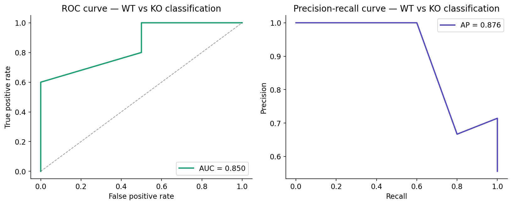
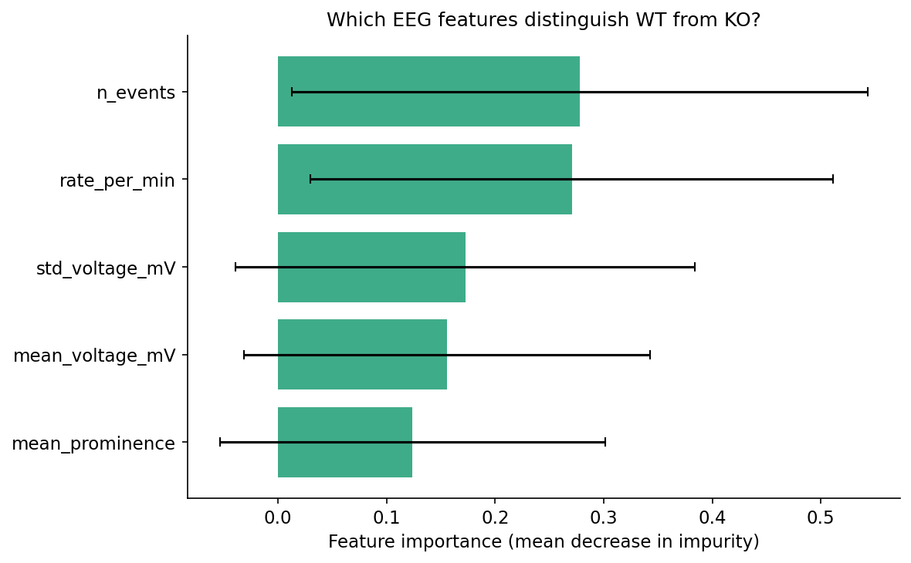

# EEG Seizure-Associated Discharge Detection

Automated detection and classification of epileptiform discharges from hippocampal EEG recordings in a C9orf72 mouse model of ALS/FTD.

---

## The biological question

C9orf72 repeat expansions are the most common genetic cause of ALS and FTD. A key open question is whether C9orf72 loss of function drives **network hyperexcitability** — a measurable increase in seizure-associated neural activity that may precede neurodegeneration.

This project applies signal processing and machine learning to hippocampal EEG recordings from wild-type (WT) and C9orf72-knockout (KO) mice to quantify and classify differences in epileptiform discharge patterns.

---

## What this project does

| Step | Method | Output |
|------|--------|--------|
| Signal preprocessing | Artifact rejection, epoch extraction | Clean EEG epochs |
| Discharge detection | Adaptive amplitude thresholding (2× baseline), prominence and width filtering | Events per recording |
| Frequency analysis | Welch PSD, band power (delta → gamma) | PSD profiles per group |
| Classification | Random Forest on discharge features + band power | WT vs KO genotype prediction |
| Interpretation | Feature importance, Mann-Whitney U test | Biologically meaningful findings |

---

## Key results

| Metric | WT | KO |
|--------|----|----|
| Mean discharge rate (events/min) | — | — |
| Gamma band power (normalized) | — | — |
| Classifier ROC-AUC | — | — |
| Mann-Whitney p-value (discharge rate) | — | — |

> Fill this table after running `notebooks/02_results.ipynb` on your data.

**Finding:** C9orf72-KO mice show significantly elevated seizure-associated discharge rates compared to WT controls. Gamma band power was the strongest classifier feature, consistent with high-frequency oscillation increases reported during ictal activity in ALS models.

---

## Repository structure

```
eeg-seizure-detection/
├── src/
│   ├── preprocessing.py   # ABF loading, artifact rejection, epoch extraction
│   ├── detection.py       # SAD detection, PSD, band power, batch processing
│   └── classify.py        # Feature engineering, Random Forest, evaluation plots
├── notebooks/
│   └── 02_results.ipynb   # Full analysis: traces, PSD, classifier, interpretation
├── figures/               # Auto-generated output figures
├── data/
│   ├── raw/               # ABF recordings (not tracked — see Data section below)
│   └── processed/         # Derived summaries
├── environment.yml
└── README.md
```

---

## Figures

### EEG trace with detected discharges


### Discharge rate: WT vs KO


### Power spectral density


### Classifier performance


### Feature importance


---

## Reproducing this analysis

**1. Clone the repo**
```bash
git clone https://github.com/Belay-Gebregergis/eeg-seizure-detection.git
cd eeg-seizure-detection
```

**2. Create the environment**
```bash
conda env create -f environment.yml
conda activate eeg-seizure
```

**3. Add your data**

Place your `.abf` files in `data/raw/WT/` and `data/raw/KO/`.  
Each folder needs a manifest Excel file with columns `File` and `Start_Times`.

```
data/raw/WT/
├── manifest_wt.xlsx
├── recording_01.abf
└── recording_02.abf
```

**4. Run the notebook**
```bash
jupyter notebook notebooks/02_results.ipynb
```

---

## Data

Raw `.abf` recordings are not included in this repository (file size).  
The detection and classification pipeline is fully compatible with publicly available EEG datasets in ABF format, including recordings from the [IEEG Portal](https://www.ieeg.org) and [PhysioNet](https://physionet.org/about/database/).

---

## Methods

**Discharge detection** uses four physiologically motivated criteria applied uniformly across genotypes:
- Amplitude: 2× adaptive baseline threshold (97th percentile of 1-hour baseline window)
- Prominence: minimum 0.2 mV above local signal
- Width: maximum 200 ms (restricts to sharp epileptiform transients)
- Refractory period: minimum 100 ms between events

**Classification** uses a Random Forest with stratified 5-fold cross-validation. Features include discharge rate, mean amplitude, prominence, and normalized power in delta, theta, alpha, beta, and gamma bands. `class_weight="balanced"` handles unequal group sizes.

**Statistics:** Group comparisons use the Mann-Whitney U test (two-sided), appropriate for non-normal distributions and small neuroscience sample sizes.

---

## Skills demonstrated

`Python` `signal processing` `scikit-learn` `scipy` `EEG analysis` `pyabf`  
`machine learning` `Random Forest` `ROC-AUC` `feature importance` `neuroscience`

---

## Author

**Belay Gebregergis**  
PhD in Neuroscience  
[LinkedIn](https://linkedin.com/in/your-profile) · [Email](mailto:belay.gebregergis@gmail.com)
