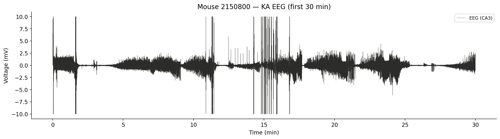
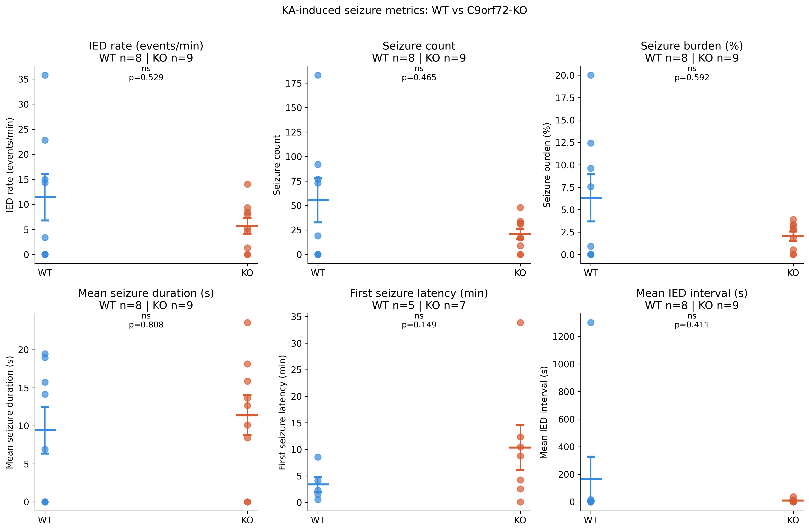
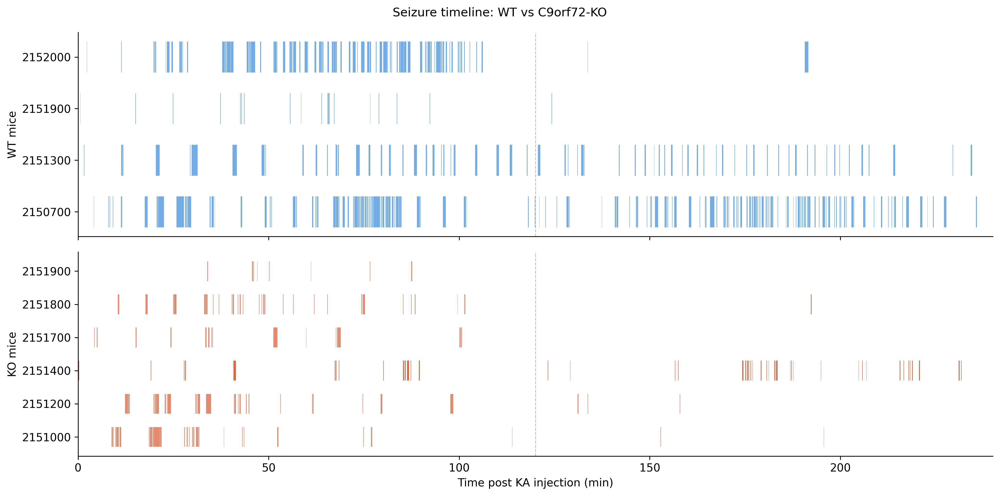
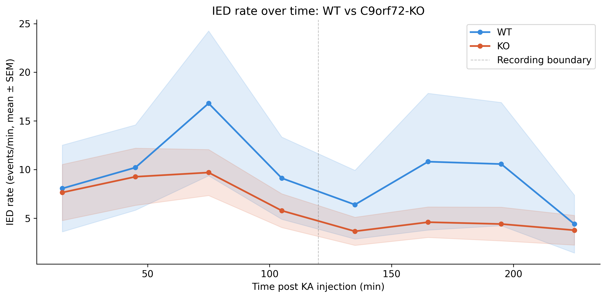

# Automated Seizure Detection — C9orf72 Mouse Model of ALS/FTD

Automated detection and quantification of seizures and interictal epileptiform discharges (IEDs) from 4-hour hippocampal EEG recordings following kainic acid injection in wild-type (WT) and C9orf72-knockout (KO) mice.

---

## The biological question

Does C9orf72 loss increase acute seizure susceptibility following kainic acid challenge? C9orf72 repeat expansions cause ALS/FTD, and network hyperexcitability has been proposed as a pathomechanism. This project uses fully automated seizure detection to quantify seizure burden, IED rate, and seizure characteristics in WT vs KO mice.

---

## Recording structure

- 8 WT mice, 9 KO mice
- Each mouse: 2 × 2h ABF recordings (consecutive files)
- Channel 0: CA3 hippocampus
- Files sorted alphabetically, paired sequentially per mouse

---

## Detection pipeline

```
1. Pair consecutive ABF files per mouse
2. Concatenate into single 4h trace
3. Artifact rejection (voltage range ±10 mV)
4. Adaptive baseline estimation (97th percentile, 1h window)
5. IED detection (amplitude > 2× baseline, width < 200ms)
6. Seizure detection (sustained IED clusters > 5 seconds)
7. Per-mouse metric computation
```

---

## Key results

| Metric | WT (n=8) | KO (n=9) | p-value | sig |
|--------|----------|----------|---------|-----|
| IED rate (events/min) | 11.4±4.6 | 5.6±1.6 | 0.529 | ns |
| Seizure count | 55.5±22.7 | 20.9±5.5 | 0.465 | ns |
| Seizure burden (%) | 6.3±2.6 | 2.1±0.5 | 0.592 | ns |
| Mean seizure duration (s) | 9.4±3.1 | 11.4±2.6 | 0.808 | ns |
| First seizure latency (min) | 3.4±1.4 | 10.3±4.3 | 0.149 | ns |
| Mean IED interval (s) | 166.2±162.0 | 9.5±3.7 | 0.411 | ns |

**Finding:** C9orf72-KO mice show no significant difference from WT in any measure of kainic acid-induced seizure activity at 4 months. This indicates that C9orf72 loss does not increase acute seizure susceptibility — network dysfunction in this model appears progressive rather than acute, consistent with longitudinal spectral findings showing theta power divergence at 3 and 12 months.

---

## Repository structure

```
eeg-seizure-detection/
├── src/
│   ├── seizure_detection.py  # Full automated detection pipeline
│   ├── preprocessing.py      # ABF loading, artifact rejection
│   ├── detection.py          # Core peak detection algorithms
│   ├── classify.py           # ML classifier utilities
│   └── utils.py              # Shared paths and helpers
├── notebooks/
│   └── 01_automated_seizure_detection.ipynb
├── figures/
├── data/processed/
├── environment.yml
└── README.md
```

---

## Figures

### EEG trace with detected events


### All seizure metrics — WT vs KO


### Seizure timeline — when do seizures occur?


### IED rate over time


---

## Reproducing this analysis

```bash
git clone https://github.com/BelayTG/eeg-seizure-detection.git
cd eeg-seizure-detection
conda env create -f environment.yml
conda activate eeg-seizure
jupyter notebook notebooks/01_automated_seizure_detection.ipynb
```

Update `BASE` in `src/utils.py` to point to your local EEG data directory.

---

## Methods

**IED detection** uses adaptive amplitude thresholding: lower threshold = 2× the 97th percentile of the first-hour baseline window. Additional criteria: prominence ≥ 0.2 mV, width < 200 ms, refractory period 100 ms.

**Seizure detection** clusters IEDs with inter-event gaps < 2 seconds into candidate seizures. Clusters with ≥ 5 IEDs and duration > 5 seconds are classified as seizures.

**File pairing:** Two consecutive 2h ABF files are concatenated into a single 4h trace per mouse. Files are sorted alphabetically and paired sequentially.

**Statistics:** Mann-Whitney U test (two-sided). Statistical unit = one mouse.

---

## Skills demonstrated

`Python` `EEG analysis` `automated seizure detection` `pyabf` `scipy`  
`peak detection` `event clustering` `longitudinal analysis` `matplotlib`

---

## Author

**Belay Gebregergis**  
PhD in Neuroscience  
[LinkedIn](https://linkedin.com/in/your-profile) · [Email](mailto:belay.gebregergis@gmail.com)  
[GitHub](https://github.com/BelayTG)
