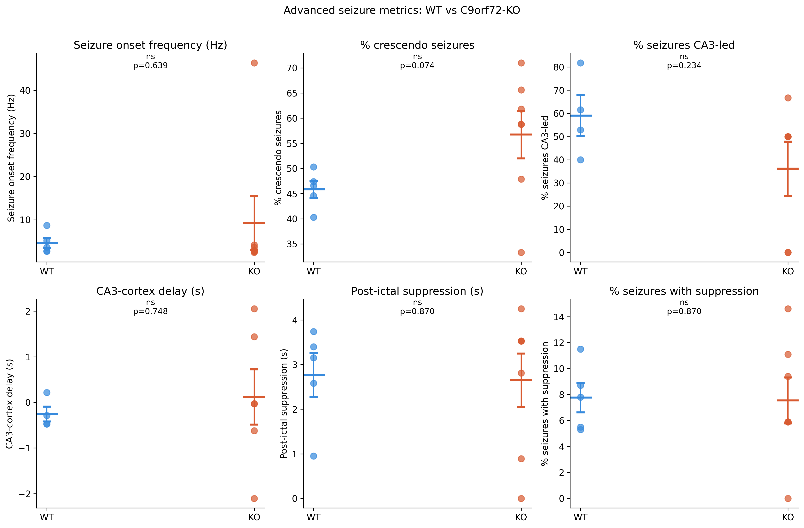
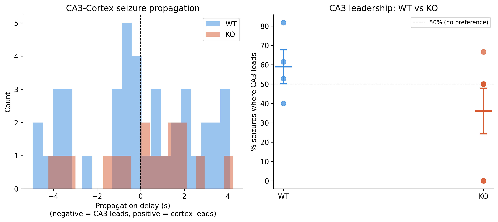
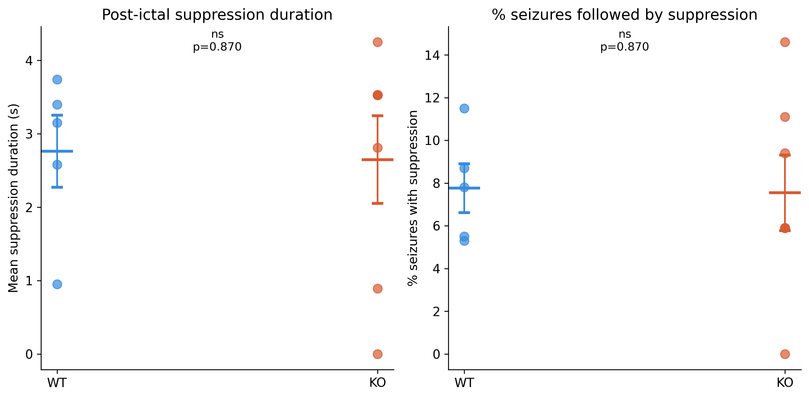
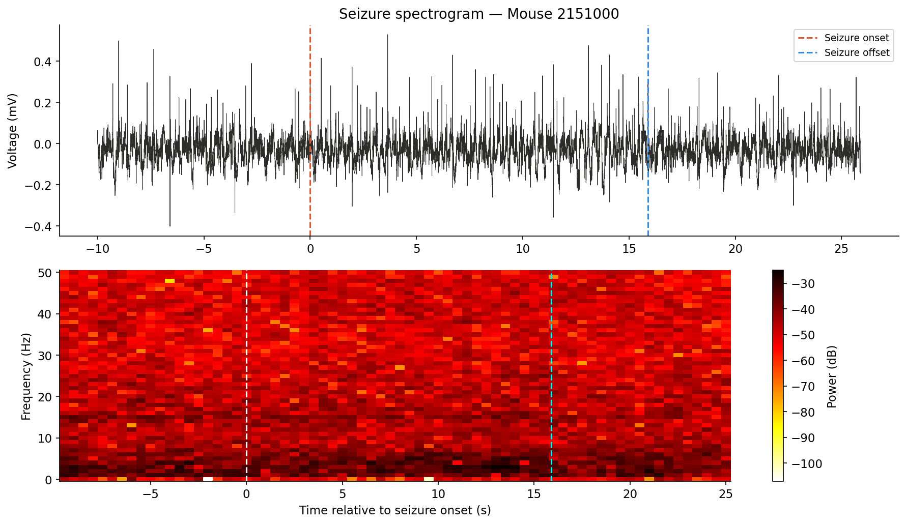

# Comprehensive Seizure Analysis — C9orf72 Mouse Model of ALS/FTD

Automated detection and characterization of seizures and interictal epileptiform discharges (IEDs) from 4-hour hippocampal EEG recordings following kainic acid injection in wild-type (WT) and C9orf72-knockout (KO) mice.

---

## The biological question

Does C9orf72 loss increase acute seizure susceptibility following kainic acid challenge? This project uses fully automated seizure detection to quantify seizure burden, IED rate, seizure morphology, hippocampal-cortical propagation, and post-ictal suppression in WT vs KO mice.

---

## Recording structure

- **WT:** 8 mice | **KO:** 9 mice
- Each mouse: 2 × 2h ABF recordings (consecutive files, flat directory)
- Channel 0: CA3 hippocampus | Channel 1: cortex
- Files sorted alphabetically, paired sequentially per mouse

---

## Analysis pipeline

```
1. Pair consecutive ABF files per mouse
2. Concatenate into single 4h trace (CA3 + cortex)
3. Artifact rejection (±10 mV range)
4. Adaptive baseline estimation (97th percentile, 1h window)
5. IED detection (amplitude > 2× baseline, width < 200ms)
6. Seizure detection (sustained IED clusters > 5 seconds)
7. Seizure morphology (onset frequency, amplitude evolution)
8. CA3-cortex propagation (which region seizes first?)
9. Post-ictal suppression detection
10. Spectral evolution (time-frequency spectrogram per seizure)
```

---

## Key results

### Core seizure metrics

| Metric | WT (n=8) | KO (n=9) | p-value | sig |
|--------|----------|----------|---------|-----|
| IED rate (events/min) | 11.4±4.6 | 5.6±1.6 | 0.529 | ns |
| Seizure count | 55.5±22.7 | 20.9±5.5 | 0.465 | ns |
| Seizure burden (%) | 6.3±2.6 | 2.1±0.5 | 0.592 | ns |
| Mean seizure duration (s) | 9.4±3.1 | 11.4±2.6 | 0.808 | ns |
| First seizure latency (min) | 3.4±1.4 | 10.3±4.3 | 0.149 | ns |
| Mean IED interval (s) | 166.2±162.0 | 9.5±3.7 | 0.411 | ns |

### Advanced seizure metrics

| Metric | WT | KO | p-value | sig |
|--------|----|----|---------|-----|
| Seizure onset frequency (Hz) | 4.6±1.1 | 9.3±6.2 | 0.639 | ns |
| % crescendo seizures | 45.8±1.7 | 56.7±4.7 | 0.074 | ns |
| % CA3-led seizures | 59.1±8.8 | 36.1±11.7 | 0.234 | ns |
| CA3-cortex delay (s) | -0.26±0.16 | 0.12±0.61 | 0.748 | ns |
| Post-ictal suppression (s) | 2.8±0.5 | 2.6±0.6 | 0.870 | ns |
| % seizures with suppression | 7.8±1.1 | 7.5±1.8 | 0.870 | ns |

**Finding:** C9orf72-KO mice show no significant difference from WT in any seizure metric following kainic acid challenge at 4 months. A non-significant trend toward more CA3-led seizures in WT (59% vs 36%) suggests possible differences in seizure initiation site. These null results indicate that C9orf72 loss does not increase acute seizure susceptibility — network dysfunction in this model is progressive rather than acute, consistent with longitudinal spectral findings showing theta power divergence at 3 and 12 months.

---

## Repository structure

```
eeg-seizure-detection/
├── src/
│   ├── seizure_detection.py  # Full automated pipeline
│   ├── preprocessing.py      # ABF loading, artifact rejection
│   ├── detection.py          # Core peak detection
│   ├── classify.py           # ML classifier utilities
│   └── utils.py              # Shared paths and helpers
├── notebooks/
│   └── 01_automated_seizure_detection.ipynb
├── figures/                  # 8 output figures
├── data/processed/
├── environment.yml
└── README.md
```

---

## Figures

### EEG trace with detected IEDs and seizures


### Core seizure metrics — WT vs KO


### Advanced metrics — morphology, propagation, suppression


### Seizure timeline


### IED rate over time


### CA3-cortex seizure propagation


### Post-ictal suppression


### Seizure spectrogram


---

## Reproducing this analysis

```bash
git clone https://github.com/BelayTG/eeg-seizure-detection.git
cd eeg-seizure-detection
conda env create -f environment.yml
conda activate eeg-seizure
jupyter notebook notebooks/01_automated_seizure_detection.ipynb
```

Update `BASE` in `src/utils.py` to point to your local EEG data directory.

---

## Methods

**IED detection:** Adaptive amplitude thresholding (2× 97th percentile of 1h baseline). Additional criteria: prominence ≥ 0.2 mV, width < 200ms, refractory period 100ms.

**Seizure detection:** IEDs clustered when inter-event gap < 2s. Clusters with ≥ 5 IEDs and duration > 5s classified as seizures.

**Seizure morphology:** Each seizure divided into 5 segments. Dominant frequency and peak amplitude computed per segment. Amplitude slope determines crescendo vs decrescendo classification.

**CA3-cortex propagation:** Seizures detected independently on each channel. Matched pairs (within 5s tolerance) compared to determine which region led and by how many seconds.

**Post-ictal suppression:** Post-seizure RMS compared to pre-seizure baseline in 2s epochs. Suppression defined as RMS < 30% of baseline.

**Statistics:** Mann-Whitney U test (two-sided). Statistical unit = one mouse.

---

## Skills demonstrated

`Python` `automated seizure detection` `EEG analysis` `dual-channel recording`  
`seizure morphology` `hippocampal-cortical propagation` `post-ictal suppression`  
`time-frequency analysis` `scipy` `pyabf` `matplotlib` `pandas`

---

## Author

**Belay Gebregergis**  
PhD in Neuroscience  
[LinkedIn](https://linkedin.com/in/your-profile) · [Email](mailto:belay.gebregergis@gmail.com)  
[GitHub](https://github.com/BelayTG)
